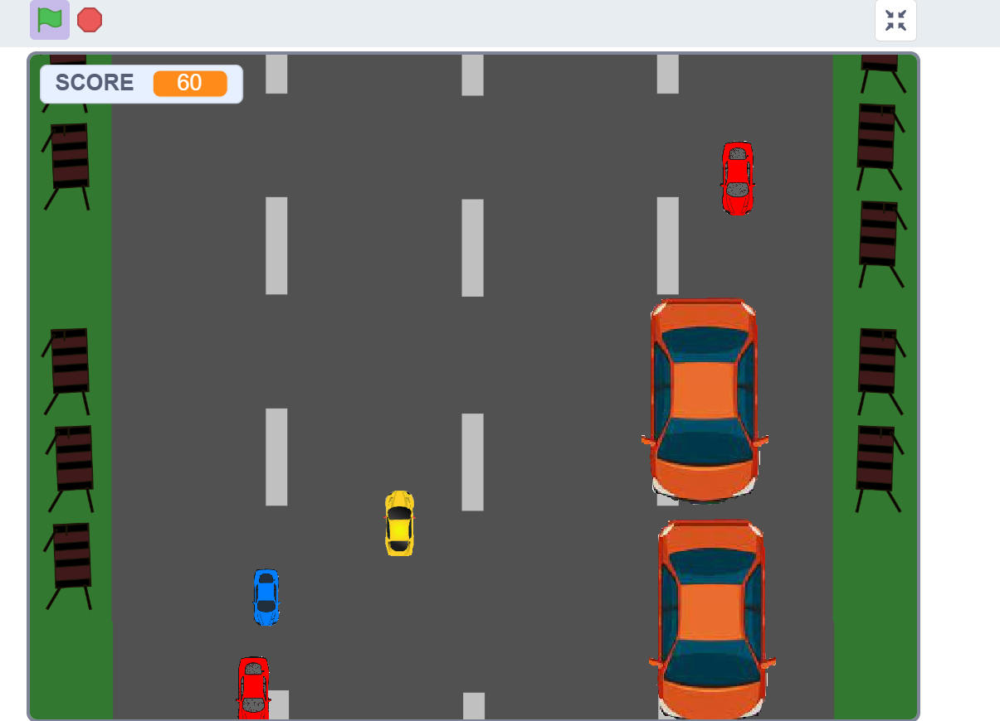
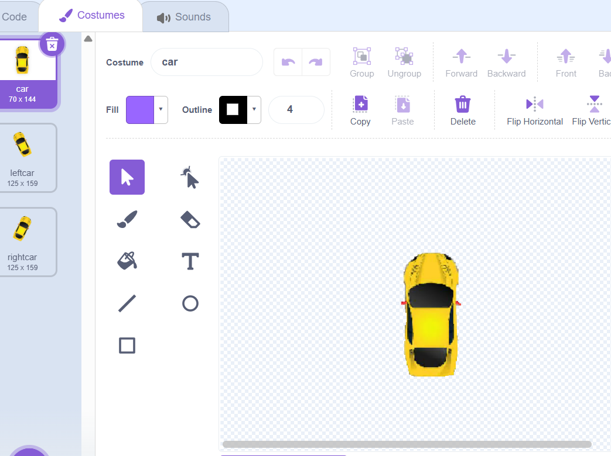
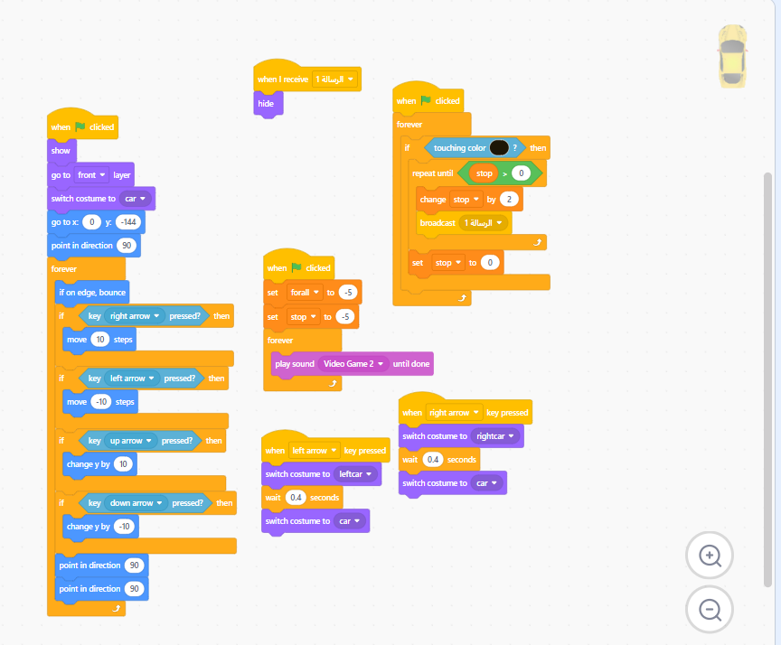
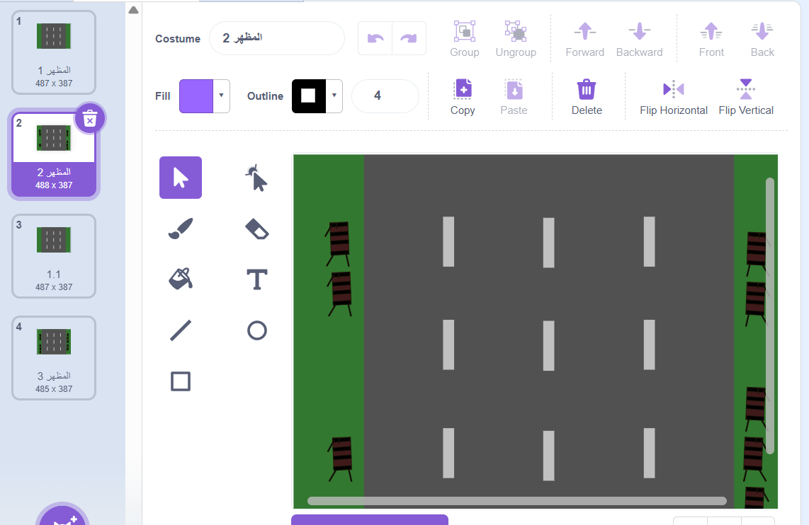

# Scratch Logic Project | Intro to Systems Programming

  
  
  
  

A fully playable 2D evasion game built in Scratch. Originally designed as an educational sandbox to teach my niece how interconnected software systems operate, this project demonstrates the fundamental building blocks of computer science in a visual, interactive format. It translates core logic used in professional software engineering into accessible block-based code, proving that complex systems thinking can be taught at any age.

## 📚 Core Coding Concepts

The game's architecture is broken down into four foundational programming concepts, showing how small scripts communicate to form a larger system:

### 1. The X/Y Coordinate Grid (Player Movement)
Moving the character requires interacting with a 2D mathematical grid.
* **The Code:** Built using `When [Key] Pressed` event listener blocks.
* **The Concept:** Pressing the **Up Arrow** increases the `Y` value (moving up), and the **Down Arrow** decreases `Y`. The **Right Arrow** increases the `X` value, and the **Left Arrow** decreases `X`. Modifying the `change x by 10` block to a higher number directly increases the entity's speed.

### 2. The `Forever` Loop (Animation)
Sprite animation is handled through continuous frame swapping.
* **The Code:** A `Next Costume` block nested inside a `Forever` loop, buffered by a `Wait 0.2 secs` delay.
* **The Concept:** Instead of manually coding each visual frame, the loop tells the computer to continuously iterate through the sprite's image states. The 0.2-second delay acts as a basic "Frame Rate" limiter.

### 3. Variables (State Management)
The game utilizes system memory to track the player's performance over time.
* **The Code:** `Set [Score] to 0` on initialization, followed by `change [Score] by 1` triggered by a persistent time event.
* **The Concept:** A variable acts as a dedicated memory container. Every second, the system retrieves the current integer in the "Score" container, increments it by 1, and updates the UI display.

### 4. Event Broadcasting (Game State Triggers)
Collision detection triggers a global state change to end the game, demonstrating how separate objects communicate.
* **The Code:** `When I receive [lose]` -> `Switch backdrop to [lose]` -> `Stop [all]`.
* **The Concept:** Sprites utilize Event Messaging to communicate asynchronously. When a collision occurs, the player sprite broadcasts a global "lose" message. The background environment listens for this event, updates the scene, and halts all active execution threads.

---

## 🎮 Execution & Controls

1. Click the **Green Flag** to initialize the runtime.
2. Use the **Arrow Keys** (⬆️ ⬇️ ⬅️ ➡️) to navigate the player entity.
3. Dodge the falling obstacles.
4. Survive to continuously increment the **Score** variable.
5. Collision results in a Game Over state. Press the Green Flag to re-initialize the loop.

## 🛠️ Modding & Customization

The codebase is designed to be easily modified. Try altering these parameters to see how the system reacts:
* **Difficulty Scaling:** Locate the `Wait 1 secs` block in the obstacle spawn script and reduce it to `0.5 secs` to double the enemy spawn rate.
* **Asset Replacement:** Navigate to the "Costumes" tab to manually edit the player sprite or replace it entirely with a new graphical asset.
